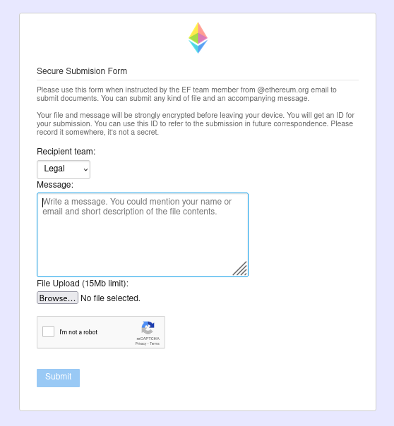

# Secure Drop

Secure-drop provides a way for users to securely, using browser-side pgp encryption on the client, submit files and/or messages to specified recipients in the Ethereum Foundation via a [web form](https://insertlink).


## User flow

1. User writes a message and/or selects a file with a selected recipient.
2. The user's browser encrypts the content using [openpgp.js](https://openpgpjs.org/) and a public key belonging to the recipient, before submitting the encrypted content to the server.
3. The server uses its email delivery service to send the email to the intended recipient.
4. The recipient receives the encrypted message/file, and can then decrypt it using their private key.


## Dependencies

### Python 3

* flask
* sendgrid
* flask_recaptcha
* dotenv


### Services

* Sendgrid
* Google reCAPTCHA


## New setup

Make a fork. Set environment variables in `.env` file or other way. Update the templates and emails in server.py.
Update public keys in [static/js/public-keys.js](static/js/public-keys.js).


## Security

If the server running the service were to be compromised, this could lead to severe issues such as public keys and email addresses being changed/added so that an attacker can also read the encrypted messages.

A server operator should follow best practises for security when setting up and operating the server running the service.

A user submitting content is advised to run the [audit tool](https://insertlink) to verify that the content of the files on the public website matches those in the github repository.


## Run
```
python3 server.py
```
